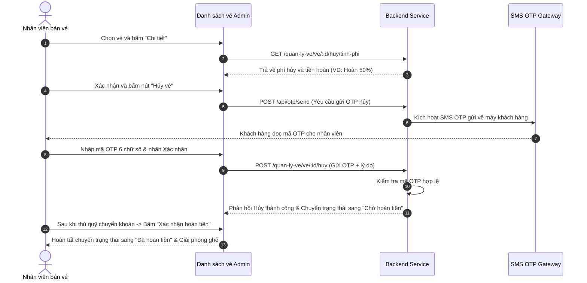

# TÀI LIỆU YÊU CẦU - MODULE QUẢN LÝ VÉ (TICKET MANAGEMENT)

| Thông tin | Chi tiết |
|-----------|----------|
| Module | Quản lý Vé (Bán vé, Tra cứu, Hủy & Hoàn tiền) |
| Hệ thống | TXP Limousine |
| URL | `/admin/quan-ly-ve/danh-sach-ve` và `/admin/quan-ly-ve/dat-ve-moi` |
| Ngày tạo | 2026-05-29 |

---

## 1. TỔNG QUAN

Module **Quản lý Vé** cung cấp công cụ cốt lõi cho **Nhân viên bán vé** (`NhanVienBanVe`) và Ban quản lý thực hiện các nghiệp vụ: bán vé trực tiếp cho khách tại quầy (thu tiền mặt hoặc VietQR), theo dõi toàn bộ danh sách vé điện tử được đặt từ hệ thống, thực hiện in nhiệt/in vé vật lý cho hành khách tại bến, và giải quyết các nghiệp vụ Hoàn trả/Huỷ vé theo quy định.

---

## 2. YÊU CẦU CHỨC NĂNG

### 2.1. Đặt vé mới tại quầy (Counter Ticket Booking)
* **AC-01:** Giao diện cho phép nhân viên chọn Điểm đi, Điểm đến, Ngày đi, chọn phòng cabin VIP cho khách hàng giống luồng Portal Khách hàng.
* **AC-02 (Phương thức thanh toán):** Nhân viên có thể tích chọn phương thức thanh toán bổ sung: **"Tiền mặt"** (Chỉ hiển thị riêng cho nhân viên).
* **AC-03 (Xuất vé):** Sau khi xác nhận thanh toán tiền mặt, hệ thống cập nhật trạng thái vé là `Đã thanh toán` và trạng thái ghế là `Đã bán`, tự động chuyển sang luồng In vé.

### 2.2. Danh sách vé xe toàn hệ thống (Ticket Audit List)
* **AC-04 (Bộ lọc nâng cao):** Cho phép lọc và tìm kiếm động theo:
  * Mã vé / Mã đơn hàng / Số điện thoại / Tên khách hàng (Ô tìm kiếm text).
  * Lọc theo Tuyến xe chạy cụ thể.
  * Lọc theo Ngày khởi hành thông qua bộ Datepicker tích hợp âm dương lịch.
  * Lọc theo Trạng thái thanh toán (`Chờ thanh toán`, `Đã thanh toán`, `Chờ hoàn tiền`, `Đã hoàn tiền`, `Đã hủy`).
  * Lọc theo Trạng thái vé (`Chờ thanh toán`, `Chờ khởi hành`, `Đã hoàn thành`, `Đã hủy`).
* **AC-05 (Phân trang):** Hiển thị tối đa 15 dòng vé trên một trang của bảng danh sách.
* **AC-06 (Thời gian thực - Realtime):** Tích hợp lắng nghe sự thay đổi các bảng `VE_DIEN_TU` và `DON_HANG` từ Supabase để tự động cập nhật/cộng thêm vé mới vào danh sách mà không cần reload trang.

### 2.3. Hủy vé & Tính phí hoàn tiền tự động (Refund Calculation)
* **AC-07 (Chính sách tính phí hủy vé tự động):** Khi nhân viên chọn Huỷ một vé đã thanh toán, hệ thống tự động so sánh thời gian hiện tại với Giờ khởi hành của xe để tính tỷ lệ hoàn tiền:
  * **Trước khởi hành > 7 ngày:** Hoàn tiền **100%** (Phí hủy 0%).
  * **Trước khởi hành > 24 giờ:** Hoàn tiền **50%** (Phí hủy 50%).
  * **Trước khởi hành > 12 giờ:** Hoàn tiền **30%** (Phí hủy 70%).
  * **Sát giờ khởi hành < 12 giờ hoặc đã qua giờ:** Hoàn tiền **0%** (Phí hủy 100%).
* **AC-08 (Xác thực OTP hủy vé):** Đối với các vé ở trạng thái `Đã thanh toán`, khi bấm Hủy bắt buộc phải gửi mã OTP về số điện thoại của khách hàng để nhân viên nhập xác nhận. Vé chưa thanh toán được phép hủy ngay mà không cần OTP.
* **AC-09 (Xác nhận hoàn tiền thủ công):** Đối với vé huỷ thanh toán qua VietQR/Cổng thanh toán lỗi chưa hoàn tự động được, vé chuyển sang trạng thái `Chờ hoàn tiền`. Sau khi thủ quỹ chuyển khoản thủ công cho khách, nhân viên bấm nút "Xác nhận hoàn tiền" để cập nhật trạng thái sang `Đã hoàn tiền` và giải phóng ghế sang `Còn trống`.

### 2.4. In vé nhiệt & Xuất PDF (Print Ticket)
* **AC-10:** Cho phép in vé trực tiếp bằng lệnh in trình duyệt (`window.print()`) thiết kế tối ưu cho khổ giấy in nhiệt K80 thông dụng tại các quầy vé.
* **AC-11:** Hỗ trợ xuất file PDF thông tin chi tiết vé để gửi cho khách qua email/Zalo.

---

## 3. ĐẶC TẢ TRƯỜNG DỮ LIỆU

### 3.1. Popup Chi tiết Vé (Ticket Detail Dialog)

| Tên trường | Loại UI | Ghi chú |
|------------|---------|---------|
| **Mã vé** | Label (Mono font) | Ví dụ: `TXP26050001` |
| **Khách hàng** | Label | Họ tên đầy đủ của hành khách |
| **Số điện thoại** | Label | Số điện thoại nhận tin nhắn |
| **Số phòng cabin**| Label | Ví dụ: `A1`, `A2`, `B5` (ghế A: tầng dưới, ghế B: tầng trên) |
| **Giá vé cơ bản** | Label | Số tiền gốc của phòng đơn |
| **Phí hủy vé** | Label | Số tiền phạt tính theo thời gian thực |
| **Số tiền hoàn trả**| Label | Tiền hoàn trả thực tế cho khách |

---

## 4. LUỒNG XỬ LÝ (WORKFLOWS)

### 4.1. Luồng Hủy vé đã thanh toán & Hoàn tiền (Happy Path)

---

## 5. TỔNG HỢP THÔNG BÁO LỖI VÀ CẢNH BÁO

| # | Thông báo | Loại | Điều kiện |
|---|-----------|------|-----------|
| 1 | Vui lòng nhập đúng mã OTP 6 chữ số. | Toast Warning | Nhập thiếu chữ số hoặc sai định dạng OTP |
| 2 | Tài khoản hiện tại chưa có quyền xem danh sách vé. | Modal Error | Nhân viên điều phối hoặc tin tức cố tình truy cập vào URL |
| 3 | Không thể hủy vé theo chính sách hiện hành. | Toast Error | Lỗi kết nối API hoặc vé đã đi qua giờ chạy |

---

## 6. CÂU HỎI CẦN LÀM RÕ VỚI PO/USER

| ID | Câu hỏi |
|----|---------|
| Q-01 | Có cần hạn chế quyền hủy vé đối với nhân viên bán vé tập sự không (chỉ được hủy vé chưa thanh toán, vé đã thanh toán phải do tổ trưởng duyệt)? |
| Q-02 | Các vé được thanh toán bằng Tiền mặt khi hủy sẽ tự động chuyển sang trạng thái "Đã hoàn tiền" ngay sau khi nhân viên trả tiền mặt tại quầy, hay vẫn đi qua "Chờ hoàn tiền"? |
