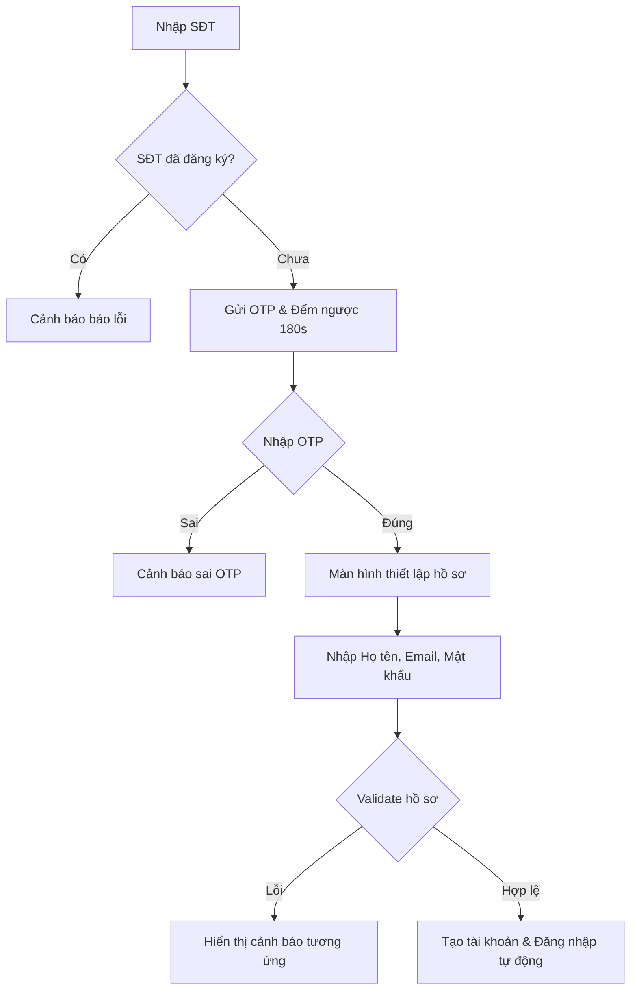

# TÀI LIỆU YÊU CẦU - MODULE ĐĂNG KÝ TÀI KHOẢN KHÁCH HÀNG (OTP VERIFICATION)

| Thông tin | Chi tiết |
|-----------|----------|
| Module | Đăng ký tài khoản (Khách hàng) |
| Hệ thống | TXP Limousine |
| URL | https://txp-bus.example.com/register (Dưới dạng popup/modal tại trang chủ) |
| Ngày tạo | 2026-05-29 |

---

## 1. TỔNG QUAN

Module **Đăng ký tài khoản** cho phép khách hàng tự tạo tài khoản cá nhân thông qua quy trình xác minh bằng số điện thoại và mã OTP (One-Time Password) gửi qua SMS để đảm bảo tính thực tế, sau đó thiết lập mật khẩu và thông tin cá nhân. Tài khoản này sẽ được dùng để quản lý đơn hàng, theo dõi lịch sử đặt vé và viết đánh giá.

---

## 2. YÊU CẦU CHỨC NĂNG

Quy trình đăng ký tài khoản khách hàng được phân bổ thành 3 bước (Steps) tuần tự:

### 2.1. Bước 1: Xác thực số điện thoại (Phone input)
* **Mô tả:** Khách hàng nhập số điện thoại để hệ thống kiểm tra sự tồn tại trong cơ sở dữ liệu.
* **AC-01:** Nhập số điện thoại sai định dạng (không đủ 10 số hoặc không bắt đầu bằng `0`, `+84`) -> Hiển thị thông báo: `"Vui lòng nhập đúng số điện thoại gồm 10 chữ số."`
* **AC-02:** Nhập số điện thoại đã tồn tại trong DB -> Báo lỗi: `"Số điện thoại này đã được đăng ký!"`
* **AC-03:** Số điện thoại hợp lệ và chưa đăng ký -> Hệ thống gửi mã OTP 6 chữ số, chuyển sang Bước 2 và bắt đầu đếm ngược thời gian hết hạn của OTP.

### 2.2. Bước 2: Nhập và Xác thực OTP (OTP Verification)
* **Mô tả:** Khách hàng nhập mã OTP gồm 6 chữ số được gửi về máy.
* **AC-04:** Hiển thị đồng hồ đếm ngược 180 giây (3 phút) dạng `MM:SS`. Khi hết thời gian, nút "Gửi lại OTP" mới được phép kích hoạt.
* **AC-05:** Ô nhập OTP gồm 6 ô độc lập. Tự động nhảy focus sang ô tiếp theo khi gõ chữ số. Nhấn nút `Backspace` tự động xoá ô hiện tại và giật ngược focus về ô trước đó. Chỉ cho phép nhập ký tự số (`0-9`).
* **AC-06:** Nhập sai mã OTP -> Báo lỗi: `"Mã xác thực không đúng. Vui lòng thử lại."`
* **AC-07:** Nhập đúng mã OTP -> Chuyển sang Bước 3 (Profile Setup).

### 2.3. Bước 3: Thiết lập Thông tin hồ sơ (Profile Setup)
* **Mô tả:** Thiết lập họ tên, email, mật khẩu để hoàn tất tạo tài khoản.
* **AC-08:** Họ tên để trống -> Báo lỗi: `"Vui lòng nhập họ tên."`
* **AC-09:** Email nhập sai cấu trúc (thiếu `@`, `.domain`) -> Báo lỗi: `"Vui lòng nhập email hợp lệ."`
* **AC-10:** Mật khẩu để trống hoặc ít hơn 6 ký tự -> Báo lỗi: `"Mật khẩu phải có ít nhất 6 ký tự."`
* **AC-11:** Mật khẩu nhập lại không khớp -> Báo lỗi: `"Mật khẩu nhập lại không khớp."`
* **AC-12:** Đăng ký thành công -> Hiển thị Toast thông báo: `"Đăng ký thành công!"`, tự động lưu thông tin đăng nhập tạm thời, đóng modal đăng ký sau 1.8 giây và tự động đăng nhập đưa khách hàng về trang chủ.

---

## 3. ĐẶC TẢ TRƯỜNG DỮ LIỆU

### 3.1. Trang Đăng ký - Bước 3 (Profile Setup)

| Tên trường | Loại UI | HTML Type | Bắt buộc | Ghi chú |
|------------|---------|-----------|----------|---------|
| **Họ và tên** | Textbox | text | Có | Không chứa số, ký tự đặc biệt |
| **Email** | Textbox | email | Không | Phải đúng cấu trúc email nếu nhập |
| **Mật khẩu** | Textbox | password | Có | Tối thiểu 6 ký tự, hỗ trợ toggle ẩn/hiện |
| **Nhập lại mật khẩu** | Textbox | password | Có | Phải trùng khớp với Mật khẩu |

---

## 4. LUỒNG XỬ LÝ (WORKFLOWS)

### 4.1. Đăng ký tài khoản thành công (Happy Path)

---

## 5. TỔNG HỢP THÔNG BÁO LỖI VÀ CẢNH BÁO

| # | Thông báo | Loại | Điều kiện |
|---|-----------|------|-----------|
| 1 | Vui lòng nhập đúng số điện thoại gồm 10 chữ số. | Client validation | Định dạng SĐT không đúng |
| 2 | Số điện thoại này đã được đăng ký! | Server validation | Trùng SĐT trong database |
| 3 | Mã xác thực không đúng. Vui lòng thử lại. | Server validation | Nhập sai OTP |
| 4 | Mật khẩu nhập lại không khớp. | Client validation | Mật khẩu xác nhận khác mật khẩu gốc |

---

## 6. CÂU HỎI CẦN LÀM RÕ VỚI PO/USER

| ID | Câu hỏi |
|----|---------|
| Q-01 | Mã OTP gửi đi có giới hạn số lần yêu cầu gửi lại trong 1 ngày đối với 1 số điện thoại hay không (để tránh spam tốn phí SMS)? |
| Q-02 | Ngoài số điện thoại Việt Nam (+84), hệ thống có hỗ trợ đăng ký bằng số điện thoại quốc tế nào khác không? |
